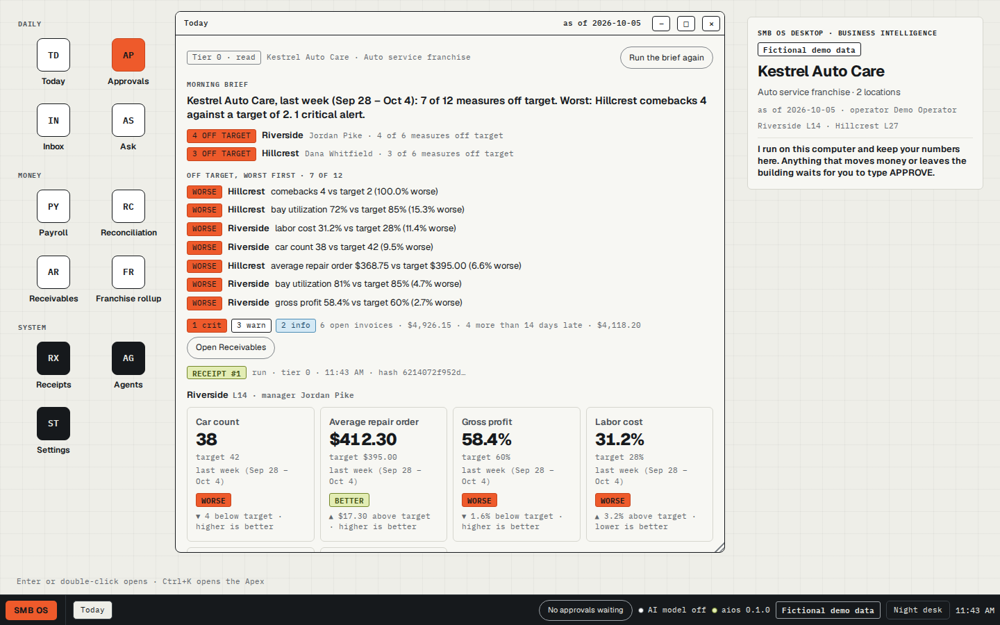
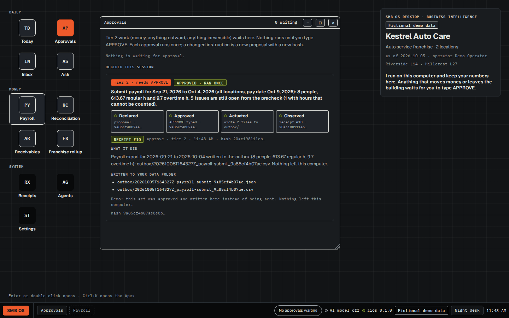
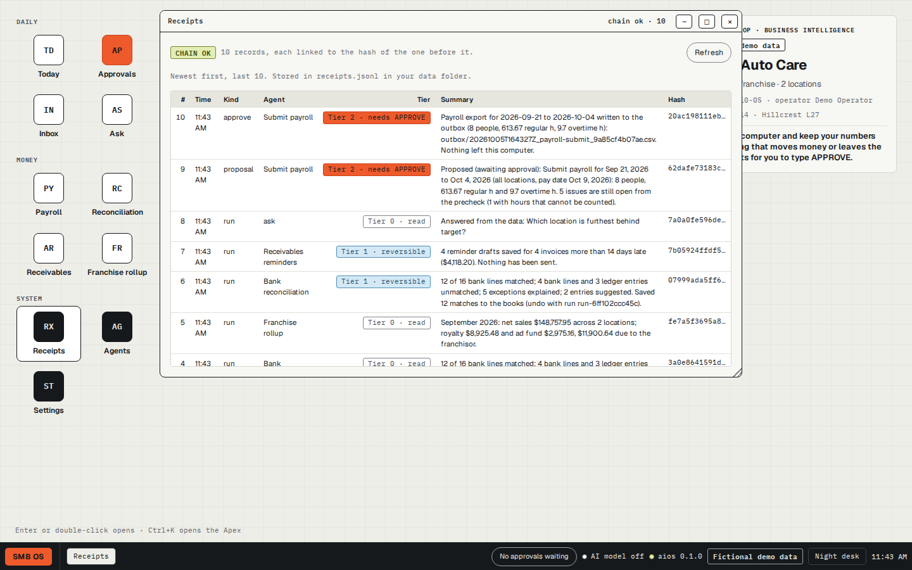
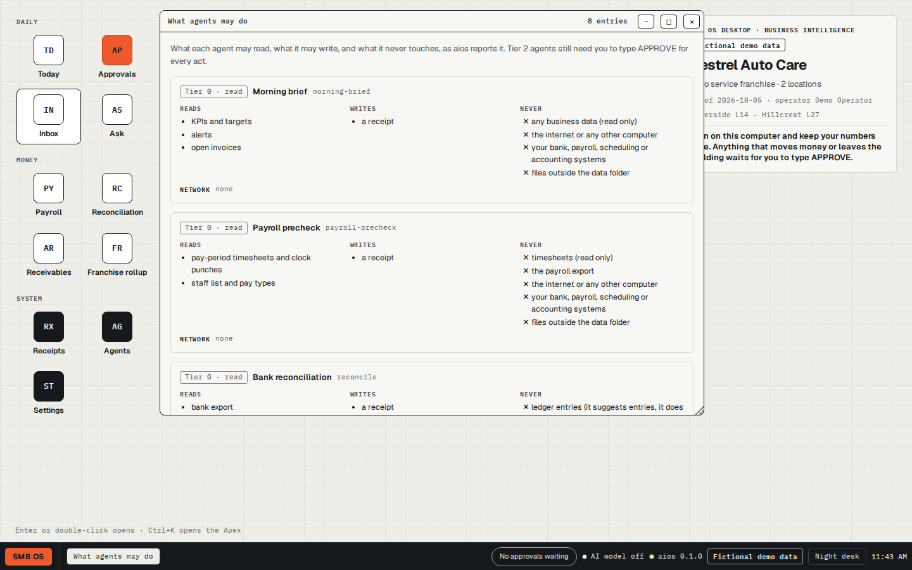
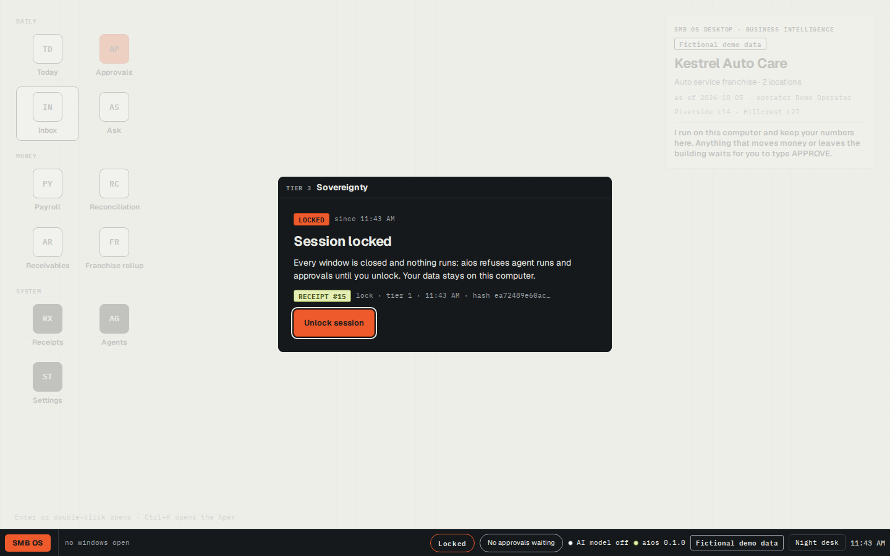

# SMB OS Desktop

**Business intelligence that runs on your computer, and answers to you.**

For the owner of a small multi-location franchise: every location's numbers against target, payroll
checked against the schedule, the bank reconciled, late invoices drafted and the franchise rollup done,
by agents that run on your own computer. The agents read, reconcile, prepare and draft. Anything that
would move money, send something outside or can't be undone stops at a gate only you can open: one exact
action at a time, once, and every step leaves a receipt.

It is one downloaded file. Double-click it and the desktop opens in your browser, with the data in a
folder on your machine. Version 0.1.0 runs on two fictional demo businesses, an auto service franchise
and a home care franchise. It does not connect to your own systems yet.

<p align="center">
  
</p>

| Waiting for a typed APPROVE | Approved, ran once | Receipts and chain check |
|---|---|---|
|  |  |  |

| The Apex, four bands | What agents may do | After Lock session |
|---|---|---|
|  |  |  |

More screenshots, including the home care business and the phone view, are in [marketing/screenshots/](marketing/screenshots/).

## Download

| Your computer | File |
|---|---|
| Windows (x86-64) | [smb-os-desktop_windows_amd64.zip](https://github.com/wayneColt/smb-os-desktop/releases/latest/download/smb-os-desktop_windows_amd64.zip) |
| Mac with Apple silicon (M1 and later) | [smb-os-desktop_darwin_arm64.zip](https://github.com/wayneColt/smb-os-desktop/releases/latest/download/smb-os-desktop_darwin_arm64.zip) |
| Mac with an Intel processor | [smb-os-desktop_darwin_amd64.zip](https://github.com/wayneColt/smb-os-desktop/releases/latest/download/smb-os-desktop_darwin_amd64.zip) |
| Linux (x86-64) | [smb-os-desktop_linux_amd64.zip](https://github.com/wayneColt/smb-os-desktop/releases/latest/download/smb-os-desktop_linux_amd64.zip) |
| Linux (ARM64) | [smb-os-desktop_linux_arm64.zip](https://github.com/wayneColt/smb-os-desktop/releases/latest/download/smb-os-desktop_linux_arm64.zip) |

These links always fetch the newest release. Checksums for every file are in
[SHA256SUMS.txt](https://github.com/wayneColt/smb-os-desktop/releases/latest/download/SHA256SUMS.txt). The exact files for 0.1.0, under their versioned names
(`smb-os-desktop_0.1.0_<os>_<arch>.zip`, same bytes), are on
[the v0.1.0 release page](https://github.com/wayneColt/smb-os-desktop/releases/tag/v0.1.0).

Or install from a terminal. Both installers download the right file for your computer, check it against
`SHA256SUMS.txt`, and start it.

macOS and Linux:

```sh
curl -fsSL https://github.com/wayneColt/smb-os-desktop/releases/latest/download/install.sh | sh
```

Windows (PowerShell):

```powershell
irm https://github.com/wayneColt/smb-os-desktop/releases/latest/download/install.ps1 | iex
```

You can read both scripts before you run them: [scripts/install.sh](scripts/install.sh),
[scripts/install.ps1](scripts/install.ps1).

## First run

1. Unzip the download. Inside are `aios` (`aios.exe` on Windows) and a short `README.txt`.
2. Double-click `aios`. On Linux, or if your file manager won't run it, start it from a terminal:
   `./aios`.
3. A terminal window opens and prints one line:

   ```text
   SMB OS Desktop running at http://127.0.0.1:7701/ (Ctrl+C to stop)
   ```

   If port 7701 is taken it uses the next free one and prints that address instead.
4. Your browser opens the desktop. If it can't open one, the window prints the address to open
   yourself. Keep the terminal window open while you work; close it, or press Ctrl+C in it, to stop.
   Double-click `aios` again while it is running and it opens the same desktop instead of starting a
   second copy.

What you'll see: the Today window for Kestrel Auto Care, a fictional auto service franchise with two
locations, with a morning brief and the week's numbers against target, worst first. Desktop icons open
Approvals, Inbox, Ask, Payroll, Reconciliation, Receivables, Franchise rollup, Receipts, Agents and
Settings. The dock along
the bottom shows open windows, how many approvals are waiting, whether an AI model is on, and the clock.
Ctrl+K opens the Apex command surface (see below). A "Fictional demo data" mark stays on screen. Settings
switches to Larkmoor Home Care, the second demo business.

Command-line options: `--port <n>`, `--data <dir>`, `--pack auto|homecare`, `--no-open` (don't open the
browser), `--version`.

## Two planes, one authority

You hold the authority. The agents run in their own plane and hold none: they read, reconcile, prepare
and draft. Between the two sits a hard gate. Every agent has a tier, and the tier decides what happens
when it is asked to run:

| Tier | What it covers | What happens |
|---|---|---|
| 0 | Reading and calculating | Runs at once. A receipt is written. |
| 1 | A reversible change that stays on your machine: switching the demo business, saving reconciliation matches, saving reminder drafts | Runs at once. A receipt is written. |
| 2 | Money, anything that leaves your machine, anything that can't be undone: submitting payroll, sending reminders | Never runs when asked. It becomes a proposal and waits for you. |

A tier-2 proposal carries a fingerprint: the SHA-256 of the exact instruction. It runs only after you
type `APPROVE` in the Approvals window, and each fingerprint runs once. Change one detail of the
instruction and it is a new proposal with a new fingerprint, which needs its own approval. An agent can
make a proposal; it has no way to approve one.

What each agent may read, what it may write and what it may never touch is listed in the Sovereignty
band of the Apex. Lock session, in the same band, stops every agent run and every approval until you
unlock.

How 0.1.0 enforces this, plainly: the gate is enforced by the program running on your computer. An
approved tier-2 act writes its payload to the `outbox` folder in your data folder and contacts nothing.
There is no separate account or sign-in, so anyone who can use this computer can open the desktop and
approve; Lock session is a pause, not a password.

The agents, all rule-based (no AI model needed):

| Agent | What it does | Tier |
|---|---|---|
| Morning brief | A headline, a line per location, and variances against target, worst first | 0 |
| Payroll pre-check | Hours against the schedule for each person: overtime, missing punches, unverified visits (home care) or flagged against clocked hours (auto service), with totals | 0 |
| Bank reconciliation | Matches bank lines to ledger entries (same amount, dates within 3 days, matching reference), lists what didn't match on both sides, and suggests entries for bank fees and interest. Saving the matches is tier 1 | 0 / 1 |
| AR reminders | Drafts reminder notes for invoices more than 14 days late and saves them as drafts | 1 |
| Send reminders | Sends the drafts (in 0.1.0: to the outbox folder) | 2 |
| Submit payroll | Writes the payroll export (in 0.1.0: to the outbox folder) | 2 |
| Franchise rollup | Revenue, royalty and ad fund for each location, and the franchise total | 0 |

## The Apex command surface

Ctrl+K (or Ctrl+Space) opens the Apex, in four bands:

- **Search:** open any window, find a location, a number, an agent, an approval or a receipt. Type a
  question and its "Ask" result opens the Ask window with it.
- **Operations:** the business right now: each location's worst measure, its alerts, and who is on shift.
- **Engine & workers:** each agent and its state (ran, needs attention, idle), its tier, and a Run button.
- **Sovereignty:** approvals waiting, whether the receipt chain is intact, where your data lives, whether
  an AI model is on, and three buttons: Lock session, "Review what agents may do" (each agent's tier, what
  it reads, what it writes, what it never touches, and its network access: none), and "Open receipts".

To stop: "Stop everything", in the Apex's top bar, cancels running requests and closes every window. "Lock
session" does the same and then locks the program, so agent runs and approvals are refused until you press
"Unlock session". The dock reads "Locked" meanwhile.

## Receipts

Every run, proposal, approval, decline and switch of demo business adds one line to `receipts.jsonl` in
your data folder. Each line includes the SHA-256 of the line before it, so changing or deleting an
earlier line breaks the chain, and the Receipts window shows whether the chain checks out.

The chain detects edits. It can't stop someone who can write to the folder from rewriting the whole file,
so keep a copy somewhere else if that matters to you.

## Your data stays on your machine

- Everything lives in one folder: `%AppData%\smb-os-desktop` on Windows,
  `~/Library/Application Support/smb-os-desktop` on macOS, `~/.config/smb-os-desktop` on Linux, or the
  folder you pass with `--data`.
- The program listens on `127.0.0.1` only, so other computers on your network can't reach it.
- It answers only requests addressed to `127.0.0.1` or `localhost`, and every change must carry a header
  that your browser won't let other websites send, so a site you happen to visit can't press buttons on
  your desktop.
- No account, no sign-in, no usage tracking. Unless you turn on an AI model, nothing leaves your machine.

## AI model: optional, off by default

Nothing in the desktop needs one. The Ask window answers from the data with plain rules and lists the
numbers it used.

To turn a model on, start the program with `ANTHROPIC_API_KEY` set in its environment. Ask then uses a
Claude model (`AIOS_MODEL`, default `claude-sonnet-5-5`), and your question and the business data it
draws on are sent to Anthropic's API. The dock shows whether a model is on.

## Where it runs: today and next

Business intelligence is only useful where the owner is working. Today that is your computer: this
download and the program it runs. Next, the same design on a phone, with approvals within thumb reach,
and on a web desk. Neither is in 0.1.0.

## The first-run prompt on macOS and Windows

The 0.1.0 files are not code-signed yet. A browser marks every downloaded file as coming from the
internet, and the operating system checks unsigned files that carry that mark:

- **macOS** says it can't verify the developer and won't open `aios`. Open System Settings, then Privacy &
  Security, scroll to the message about `aios`, click Open Anyway and confirm. (On macOS 15 and later,
  Control-click then Open no longer skips this step.)
- **Windows** may show "Windows protected your PC". Click More info, then Run anyway. Your browser may
  also ask whether to keep the file.
- **Linux** doesn't ask.

The one-line installers download with `curl` or PowerShell, which don't add that mark, so the prompt
doesn't appear. They check the file against `SHA256SUMS.txt` before they start it. Either way, you can
check a file yourself and compare the result with its line in `SHA256SUMS.txt`:

```sh
shasum -a 256 smb-os-desktop_darwin_arm64.zip   # macOS
sha256sum smb-os-desktop_linux_amd64.zip        # Linux
```

```powershell
Get-FileHash smb-os-desktop_windows_amd64.zip    # Windows
```

## What 0.1.0 does not do

- Connect to your scheduling, shop-management or accounting system, or read your bank export. It runs on
  the two fictional demo businesses only.
- Send anything. Approved tier-2 acts are written to the outbox folder.
- Run on a phone or as a web desk. Both are the next step, not part of this release.
- Ship signed binaries. See the first-run prompt above.
- Keep separate accounts. Anyone who can use the computer can use the desktop; Lock session stops agents
  and approvals but is not a password.
- Update itself.

## Build from source

Needs Go 1.27 or later and nothing else.

```sh
git clone https://github.com/wayneColt/smb-os-desktop.git
cd smb-os-desktop
go test ./...
go build -o aios ./cmd/aios
./aios
```

`scripts/build_release.sh` builds the release zips for all five platforms.

## License

MIT, see [LICENSE](LICENSE). The fonts in `web/ds/fonts/` are under the SIL Open Font License 1.1; their
license files sit beside them. The demo businesses, people and numbers are fictional.

Made by Wayne Colt at Catalytic Computing. [waynecolt.com](https://waynecolt.com/) ·
wayne@catalytic-computing.com
